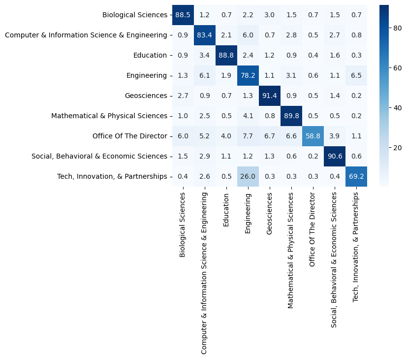
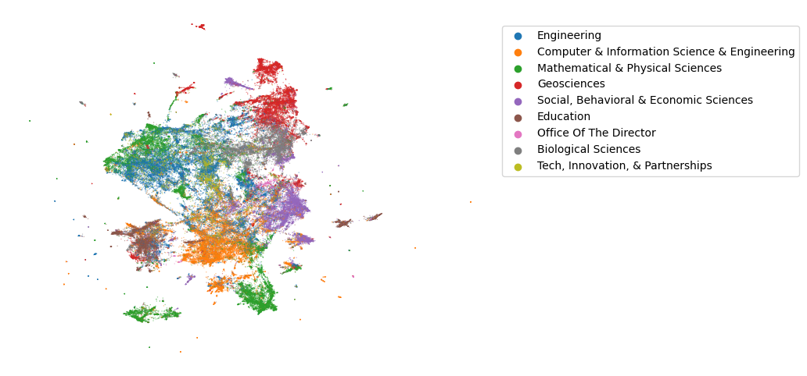

We start by retrieving the NSF Grant data files. The grant data, including abstracts of the funded projects, are available as zipped XML files on the [NSF web pages](https://www.nsf.gov/awardsearch/download.jsp). We download the data and extract the relevant parts with `BeautifulSoup`. Since the zip files are rather large and need a lot of memory, we work with one zip file at a time and append the results to an uncompressed CSV file.


```python
from bs4 import BeautifulSoup
from zipfile import ZipFile
import pandas as pd
from glob import glob

def parse_xml(soup):
    xdata = []
    xdata.append(soup.find('AwardEffectiveDate').string[-4:])
    xdata.append(soup.find('AwardInstrument').find('Value').string)
    xdata.append(soup.find('Directorate').find('LongName').string)
    xdata.append(soup.find('Division').find('LongName').string)
    xdata.append(int(soup.find('AwardAmount').string))
    xdata.append(soup.find('AbstractNarration').string)
    return xdata

def readzips(zfiles, outfile):
    headers = ['year', 'instrument', 'directorate', 'division', 'funding', 'abstract']
    df = pd.DataFrame(columns=headers)
    df.to_csv('./nsf-standard-grants.csv', encoding='utf-8')
    for zf in zfiles:
        xlist = []
        with ZipFile(zf) as z:
            for filename in z.namelist():
                if filename[-3:] == 'xml':
                    with z.open(filename) as f:
                        soup = BeautifulSoup(f, 'xml')                        
                        xlist.append(parse_xml(soup))
        df = pd.DataFrame(xlist, columns=headers)
        df = df[df.instrument == 'Standard Grant']
        df.to_csv(outfile, encoding='utf-8', header=None, mode='a')
        del df, xlist

outfile = './nsf-standard-grants.csv'
readzips(glob('*.zip'), outfile)
```

We then read the entire data set into memory from the CSV file, remove duplicated rows and compress the data.


```python
df = pd.read_csv(outfile,  index_col=0, encoding='utf-8')
df.drop_duplicates(inplace=True)
df.to_csv(outfile + '.xz', encoding='utf-8')
```

Next we load some useful libraries for exploratory data analysis and visualisation.


```python
from sklearn.svm import LinearSVC
from sklearn.feature_extraction.text import TfidfVectorizer, CountVectorizer, TfidfTransformer
from sklearn import preprocessing
from sklearn.manifold import TSNE, SpectralEmbedding
from sklearn.model_selection import cross_val_score, cross_val_predict
from sklearn.decomposition import LatentDirichletAllocation, NMF, TruncatedSVD
from sklearn.metrics import confusion_matrix
from sklearn.pipeline import Pipeline
from umap import UMAP

import matplotlib.pyplot as plt
import seaborn as sns
```

We load the previously saved grant data to a Pandas dataframe and check the structure and headings of the data.


```python
df = pd.read_csv('./nsf-standard-grants.csv.xz', index_col=0, encoding='utf-8')
df.head()
```


<div>
<style scoped>
    .dataframe tbody tr th:only-of-type {
        vertical-align: middle;
    }

    .dataframe tbody tr th {
        vertical-align: top;
    }

    .dataframe thead th {
        text-align: right;
    }
</style>
<table border="1" class="dataframe">
  <thead>
    <tr style="text-align: right;">
      <th></th>
      <th>year</th>
      <th>instrument</th>
      <th>directorate</th>
      <th>division</th>
      <th>abstract</th>
      <th>funding</th>
    </tr>
  </thead>
  <tbody>
    <tr>
      <th>0</th>
      <td>2008</td>
      <td>Standard Grant</td>
      <td>Directorate For Engineering</td>
      <td>Div Of Civil, Mechanical, &amp; Manufact Inn</td>
      <td>NSF Proposal # 0800628: Management in Supply C...</td>
      <td>281167.0</td>
    </tr>
    <tr>
      <th>1</th>
      <td>2008</td>
      <td>Standard Grant</td>
      <td>Direct For Computer &amp; Info Scie &amp; Enginr</td>
      <td>Division Of Computer and Network Systems</td>
      <td>Proposal Summary: The Association for Computin...</td>
      <td>20200.0</td>
    </tr>
    <tr>
      <th>2</th>
      <td>2008</td>
      <td>Standard Grant</td>
      <td>Directorate For Engineering</td>
      <td>Div Of Civil, Mechanical, &amp; Manufact Inn</td>
      <td>The research objective of this Grant Opportuni...</td>
      <td>177948.0</td>
    </tr>
    <tr>
      <th>3</th>
      <td>2008</td>
      <td>Standard Grant</td>
      <td>Directorate For Engineering</td>
      <td>Div Of Civil, Mechanical, &amp; Manufact Inn</td>
      <td>Abstract &lt;br/&gt;The research objective of this a...</td>
      <td>222600.0</td>
    </tr>
    <tr>
      <th>4</th>
      <td>2008</td>
      <td>Standard Grant</td>
      <td>Directorate For Engineering</td>
      <td>Div Of Civil, Mechanical, &amp; Manufact Inn</td>
      <td>This research will lead to advanced, functiona...</td>
      <td>309973.0</td>
    </tr>
  </tbody>
</table>
</div>


Let's see how many abstracts there are per each directorate.


```python
df.groupby('directorate').count()['abstract']
```


    directorate
    Dir for Tech, Innovation, & Partnerships                         3495
    Direct For Biological Sciences                                  10594
    Direct For Computer & Info Scie & Enginr                        18405
    Direct For Education and Human Resources                         6909
    Direct For Mathematical & Physical Scien                        20218
    Direct For Social, Behav & Economic Scie                        12068
    Directorate For Engineering                                     26773
    Directorate For Geosciences                                     13157
    Directorate for Computer & Information Science & Engineering        2
    Directorate for STEM Education                                   3115
    Directorate for Social, Behavioral & Economic Sciences              3
    Office Of Polar Programs                                            3
    Office Of The Director                                           1708
    Name: abstract, dtype: int64


Some of the directorates seem to have been spelled in multiple ways. We clean up the data by remapping the directorates to a more compact list.


```python
dir_map = {
    'Dir for Tech, Innovation, & Partnerships': 'Tech, Innovation, & Partnerships', 
    'Direct For Biological Sciences': 'Biological Sciences', 
    'Direct For Computer & Info Scie & Enginr': 'Computer & Information Science & Engineering', 
    'Direct For Education and Human Resources': 'Education', 
    'Direct For Mathematical & Physical Scien': 'Mathematical & Physical Sciences', 
    'Direct For Social, Behav & Economic Scie': 'Social, Behavioral & Economic Sciences', 
    'Directorate For Engineering': 'Engineering', 
    'Directorate For Geosciences': 'Geosciences', 
    'Directorate for Computer & Information Science & Engineering': 'Computer & Information Science & Engineering', 
    'Directorate for STEM Education': 'Education', 
    'Directorate for Social, Behavioral & Economic Sciences': 'Social, Behavioral & Economic Sciences', 
    'Office Of Polar Programs': 'Geosciences', 
    'Office Of The Director': 'Office Of The Director'
}

df['directorate'] = df['directorate'].map(dir_map)
```

We drop rows that contain an empty abstract from our dataframe and recheck how many abstracts there are per each directorate.


```python
df.dropna(subset=['abstract'], inplace=True)
df.groupby('directorate').count()['abstract']
```


    directorate
    Biological Sciences                             10594
    Computer & Information Science & Engineering    18407
    Education                                       10024
    Engineering                                     26773
    Geosciences                                     13160
    Mathematical & Physical Sciences                20218
    Office Of The Director                           1708
    Social, Behavioral & Economic Sciences          12071
    Tech, Innovation, & Partnerships                 3495
    Name: abstract, dtype: int64


```python
df.shape
```


    (116450, 6)


The number of grants per directorate and year.


```python
directorates = sorted(df['directorate'].unique())
pd.crosstab(df.directorate, df.year)
```


<div>
<style scoped>
    .dataframe tbody tr th:only-of-type {
        vertical-align: middle;
    }

    .dataframe tbody tr th {
        vertical-align: top;
    }

    .dataframe thead th {
        text-align: right;
    }
</style>
<table border="1" class="dataframe">
  <thead>
    <tr style="text-align: right;">
      <th>year</th>
      <th>2006</th>
      <th>2007</th>
      <th>2008</th>
      <th>2009</th>
      <th>2010</th>
      <th>2011</th>
      <th>2012</th>
      <th>2013</th>
      <th>2014</th>
      <th>2015</th>
      <th>2016</th>
      <th>2017</th>
      <th>2018</th>
      <th>2019</th>
      <th>2020</th>
      <th>2021</th>
      <th>2022</th>
      <th>2023</th>
    </tr>
    <tr>
      <th>directorate</th>
      <th></th>
      <th></th>
      <th></th>
      <th></th>
      <th></th>
      <th></th>
      <th></th>
      <th></th>
      <th></th>
      <th></th>
      <th></th>
      <th></th>
      <th></th>
      <th></th>
      <th></th>
      <th></th>
      <th></th>
      <th></th>
    </tr>
  </thead>
  <tbody>
    <tr>
      <th>Biological Sciences</th>
      <td>0</td>
      <td>17</td>
      <td>495</td>
      <td>1267</td>
      <td>829</td>
      <td>670</td>
      <td>663</td>
      <td>648</td>
      <td>666</td>
      <td>734</td>
      <td>748</td>
      <td>694</td>
      <td>540</td>
      <td>623</td>
      <td>790</td>
      <td>584</td>
      <td>569</td>
      <td>57</td>
    </tr>
    <tr>
      <th>Computer &amp; Information Science &amp; Engineering</th>
      <td>0</td>
      <td>12</td>
      <td>894</td>
      <td>1480</td>
      <td>1164</td>
      <td>1098</td>
      <td>1216</td>
      <td>1133</td>
      <td>1165</td>
      <td>1328</td>
      <td>1347</td>
      <td>1363</td>
      <td>1430</td>
      <td>1366</td>
      <td>1324</td>
      <td>1010</td>
      <td>1022</td>
      <td>55</td>
    </tr>
    <tr>
      <th>Education</th>
      <td>0</td>
      <td>4</td>
      <td>470</td>
      <td>755</td>
      <td>689</td>
      <td>611</td>
      <td>632</td>
      <td>605</td>
      <td>579</td>
      <td>708</td>
      <td>735</td>
      <td>664</td>
      <td>714</td>
      <td>666</td>
      <td>735</td>
      <td>719</td>
      <td>667</td>
      <td>71</td>
    </tr>
    <tr>
      <th>Engineering</th>
      <td>0</td>
      <td>41</td>
      <td>1118</td>
      <td>2381</td>
      <td>2162</td>
      <td>1855</td>
      <td>1900</td>
      <td>1981</td>
      <td>2080</td>
      <td>2175</td>
      <td>2419</td>
      <td>2068</td>
      <td>1760</td>
      <td>1338</td>
      <td>1232</td>
      <td>1043</td>
      <td>1115</td>
      <td>105</td>
    </tr>
    <tr>
      <th>Geosciences</th>
      <td>1</td>
      <td>19</td>
      <td>543</td>
      <td>1566</td>
      <td>1155</td>
      <td>1008</td>
      <td>933</td>
      <td>759</td>
      <td>732</td>
      <td>770</td>
      <td>824</td>
      <td>739</td>
      <td>673</td>
      <td>838</td>
      <td>883</td>
      <td>892</td>
      <td>755</td>
      <td>70</td>
    </tr>
    <tr>
      <th>Mathematical &amp; Physical Sciences</th>
      <td>0</td>
      <td>38</td>
      <td>826</td>
      <td>1997</td>
      <td>1411</td>
      <td>1176</td>
      <td>1282</td>
      <td>1104</td>
      <td>1216</td>
      <td>1293</td>
      <td>1323</td>
      <td>1234</td>
      <td>1516</td>
      <td>1541</td>
      <td>1514</td>
      <td>1282</td>
      <td>1440</td>
      <td>25</td>
    </tr>
    <tr>
      <th>Office Of The Director</th>
      <td>0</td>
      <td>5</td>
      <td>106</td>
      <td>194</td>
      <td>226</td>
      <td>165</td>
      <td>91</td>
      <td>74</td>
      <td>116</td>
      <td>69</td>
      <td>53</td>
      <td>70</td>
      <td>97</td>
      <td>92</td>
      <td>81</td>
      <td>127</td>
      <td>110</td>
      <td>32</td>
    </tr>
    <tr>
      <th>Social, Behavioral &amp; Economic Sciences</th>
      <td>0</td>
      <td>12</td>
      <td>581</td>
      <td>1194</td>
      <td>975</td>
      <td>801</td>
      <td>872</td>
      <td>807</td>
      <td>843</td>
      <td>851</td>
      <td>802</td>
      <td>804</td>
      <td>696</td>
      <td>697</td>
      <td>873</td>
      <td>660</td>
      <td>577</td>
      <td>26</td>
    </tr>
    <tr>
      <th>Tech, Innovation, &amp; Partnerships</th>
      <td>0</td>
      <td>0</td>
      <td>0</td>
      <td>0</td>
      <td>0</td>
      <td>0</td>
      <td>0</td>
      <td>0</td>
      <td>0</td>
      <td>0</td>
      <td>0</td>
      <td>1</td>
      <td>432</td>
      <td>831</td>
      <td>805</td>
      <td>763</td>
      <td>658</td>
      <td>5</td>
    </tr>
  </tbody>
</table>
</div>


# Classification

Let's train a simple linear classifier and check how well the model can predict under which directorate each abstract belongs. First we transform the abstracts to a document-term matrix using `CountVectorizer`. We use unigrams as features since the vocabulary size becomes rather large with bigrams. 


```python
vect_clf = CountVectorizer(stop_words='english', ngram_range=(1,1), max_df=0.2, min_df=2)
X = vect_clf.fit_transform(df.abstract)
X.shape
```


    (116450, 85757)


We set up a classifier pipeline with `TfidfTransformer` and `LinearSVC`. Note that we did not use `TfidfVectorizer` above in order to avoid data leakage during cross-validation but instead apply `TfidfTransformer` separately for each train and test set.


```python
clf = LinearSVC(class_weight='balanced')
tfidf = TfidfTransformer(sublinear_tf=True)
pipe = Pipeline([('tfidf', tfidf), ('clf', clf)])
```

Now we can check how well the model performs. We do this by a 5-fold cross-validation and check the average accuracy score.


```python
score = cross_val_score(pipe, X, df.directorate, cv=5, n_jobs=-1)
print(score, score.mean())
```

    [0.8455131  0.87084586 0.86994418 0.84753113 0.82271361] 0.8513095749248605


Accuracy score of 0.85 is quite decent. We will also check which directorates the model mixes up by calculating the confusion matrix between the predicted and actual directorates.


```python
pred_directorate = cross_val_predict(pipe, X, df.directorate, cv=5, n_jobs=-1)

cfm = (100*confusion_matrix(df.directorate, pred_directorate, labels=directorates, normalize='true')).round(1)
```

The model has learned to separate Geosciences and Social, Behavioral & Economic Sciences most consistently from the other directorates. "Office of the Director" and "Tech, Innovation, & Partnerships" are most often mixed with other directorates but these two have the lowest number of grants which likely has a negative impact on the accuracy.


```python
sns.heatmap(cfm, cmap='Blues', annot=True, fmt='.1f', xticklabels=directorates, yticklabels=directorates)
plt.plot()
```


    []


    

    


## Visualisation

Let's try to visualize the dataset. This time we transform the full dataset with `TfidfVectorizer` to a normalized document-term matrix.


```python
vect = TfidfVectorizer(stop_words='english', ngram_range=(1,1), sublinear_tf=True, max_df=0.2, min_df=10)
X = vect.fit_transform(df.abstract)
fnames = vect.get_feature_names_out()
X.shape
```


    (116450, 33219)


We embed the vectorized abstracts to 2 dimensions with [`UMAP`](https://umap-learn.readthedocs.io/en/latest/) using the angle between the vectors ("[cosine distance](https://en.wikipedia.org/wiki/Cosine_similarity#Cosine_Distance)") as the distance metric.


```python
Xr = UMAP(n_components=2, n_neighbors=10, metric='cosine').fit_transform(X)
df['x'] = Xr[:,0]
df['y'] = Xr[:,1]
```

Now we can create a scatterplot of the data. The resulting plot shows that abstracts coming from the same directorate are most often fairly well clumped together, but there are also some clusters that contain abstracts from multiple directorates. This seems to happen especially with abstracts from Mathematical & Physical Sciences and Engineering.


```python
fig, ax = plt.subplots(figsize=[8,6])
sns.scatterplot(data=df, x='x', y='y', hue='directorate', s=1, alpha=0.5, linewidth=0, ax=ax)
plt.axis('off')
plt.legend(bbox_to_anchor=(1.02, 0.95), loc='upper left', borderaxespad=0)
plt.show()
```


    

    


Next we try to identify some keywords that have been emerging in the last few years. Before that, [we will do some simple preprocessing of the abstract texts with spaCy](./nsf-spacy.html).
