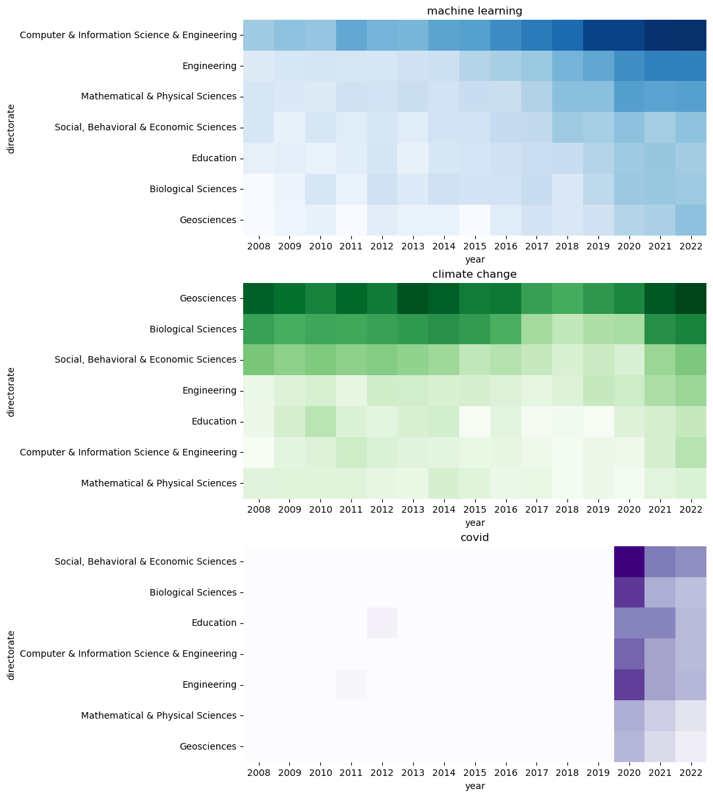

This is a small example of visualisation of the occurrence of selected keywords in the scientific abstracts of grant proposals in different research fields / directorates. It relies only on `pandas`, `numpy`, `matplotlib` and `seaborn`.


```python
import pandas as pd
import numpy as np
import matplotlib.pyplot as plt
import seaborn as sns
```

Load the data to a Pandas dataframe and check the structure and headings of the data.


```python
df = pd.read_csv('./nsf-standard-grants.csv.xz', index_col=0, encoding='utf-8')
df.head()
```


<div>
<style scoped>
    .dataframe tbody tr th:only-of-type {
        vertical-align: middle;
    }

    .dataframe tbody tr th {
        vertical-align: top;
    }

    .dataframe thead th {
        text-align: right;
    }
</style>
<table border="1" class="dataframe">
  <thead>
    <tr style="text-align: right;">
      <th></th>
      <th>year</th>
      <th>instrument</th>
      <th>directorate</th>
      <th>division</th>
      <th>abstract</th>
      <th>funding</th>
    </tr>
  </thead>
  <tbody>
    <tr>
      <th>0</th>
      <td>2008</td>
      <td>Standard Grant</td>
      <td>Directorate For Engineering</td>
      <td>Div Of Civil, Mechanical, &amp; Manufact Inn</td>
      <td>NSF Proposal # 0800628: Management in Supply C...</td>
      <td>281167.0</td>
    </tr>
    <tr>
      <th>1</th>
      <td>2008</td>
      <td>Standard Grant</td>
      <td>Direct For Computer &amp; Info Scie &amp; Enginr</td>
      <td>Division Of Computer and Network Systems</td>
      <td>Proposal Summary: The Association for Computin...</td>
      <td>20200.0</td>
    </tr>
    <tr>
      <th>2</th>
      <td>2008</td>
      <td>Standard Grant</td>
      <td>Directorate For Engineering</td>
      <td>Div Of Civil, Mechanical, &amp; Manufact Inn</td>
      <td>The research objective of this Grant Opportuni...</td>
      <td>177948.0</td>
    </tr>
    <tr>
      <th>3</th>
      <td>2008</td>
      <td>Standard Grant</td>
      <td>Directorate For Engineering</td>
      <td>Div Of Civil, Mechanical, &amp; Manufact Inn</td>
      <td>Abstract &lt;br/&gt;The research objective of this a...</td>
      <td>222600.0</td>
    </tr>
    <tr>
      <th>4</th>
      <td>2008</td>
      <td>Standard Grant</td>
      <td>Directorate For Engineering</td>
      <td>Div Of Civil, Mechanical, &amp; Manufact Inn</td>
      <td>This research will lead to advanced, functiona...</td>
      <td>309973.0</td>
    </tr>
  </tbody>
</table>
</div>


We clean up the list of directorates [as in the previous notebook](./initial_exploration.html).


```python
dir_map = {
    'Dir for Tech, Innovation, & Partnerships': 'Tech, Innovation, & Partnerships', 
    'Direct For Biological Sciences': 'Biological Sciences', 
    'Direct For Computer & Info Scie & Enginr': 'Computer & Information Science & Engineering', 
    'Direct For Education and Human Resources': 'Education', 
    'Direct For Mathematical & Physical Scien': 'Mathematical & Physical Sciences', 
    'Direct For Social, Behav & Economic Scie': 'Social, Behavioral & Economic Sciences', 
    'Directorate For Engineering': 'Engineering', 
    'Directorate For Geosciences': 'Geosciences', 
    'Directorate for Computer & Information Science & Engineering': 'Computer & Information Science & Engineering', 
    'Directorate for STEM Education': 'Education', 
    'Directorate for Social, Behavioral & Economic Sciences': 'Social, Behavioral & Economic Sciences', 
    'Office Of Polar Programs': 'Geosciences', 
    'Office Of The Director': 'Office Of The Director'
}

df['directorate'] = df['directorate'].map(dir_map)
df.dropna(subset=['abstract'], inplace=True)
df.groupby('directorate').count()['abstract']
```


    directorate
    Biological Sciences                             10594
    Computer & Information Science & Engineering    18407
    Education                                       10024
    Engineering                                     26773
    Geosciences                                     13160
    Mathematical & Physical Sciences                20218
    Office Of The Director                           1708
    Social, Behavioral & Economic Sciences          12071
    Tech, Innovation, & Partnerships                 3495
    Name: abstract, dtype: int64


We filter out directorates that contain less than 5000 abstracts.


```python
df = df.groupby('directorate').filter(lambda x : len(x) >= 5000)
```

Let's focus the examination on abstracts between years 2008 and 2022.


```python
sel_years = list(range(2008, 2023))
```

We perform a heatmap visualisation of the proportion of abstracts that contain a given keyword in different years and directorates. We define two helper functions, `pivot_years` and `heatmap_years`, which create and display the heatmap, respectively. Square root is applied to all the values in the pivot table to help visualise differences between small and large values in the heatmap.


```python
def pivot_years(kw):
    df['kw'] = df.abstract.str.contains(kw, case=False).map({True:1, False:0})
    pivot = df[df.year.isin(sel_years)].pivot_table(index='directorate', columns='year', values='kw', fill_value=0, aggfunc='mean', margins=True)
    pivot.drop('All', axis=0, inplace=True)
    pivot.sort_values('All', ascending=False, inplace=True)
    pivot.drop('All', axis=1, inplace=True)
    return pivot.apply(np.sqrt)

def heatmap_years(kw, cmap, ax):
    sns.heatmap(data=pivot_years(kw), cmap=cmap, ax=ax, square=True, cbar=False, yticklabels=True, annot=False)
    ax.set_title(kw)
```

Below is a visualisation of a few select keywords. It is probably not so surprising that `machine learning` has been most prominent in the abstracts of Computer & Information Science & Engineering directorate and it seems to be still on the rise. Similarly, `climate change` has occurred most frequently in Geosciences and Biological Sciences. As a third example, `covid` has really appeared in abstracts only after 2020 (there are some false hits before year 2020: some projects have been sponsored by a health care products company called Covidien before the outbreak of the pandemic). 


```python
fig, (ax1, ax2, ax3) = plt.subplots(3, figsize=[12,12], constrained_layout=True)
heatmap_years('machine learning', 'Blues', ax1)
heatmap_years('climate change', 'Greens', ax2)
heatmap_years('covid', 'Purples', ax3)
plt.plot();
```


    

    

