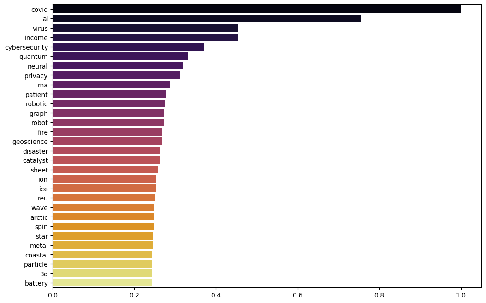

The aim of the following exercise is to examine the NSF Grant data set and identify keywords that have been emerging during the last few years. We employ some statistical measures in order to capture keywords that have high relevance, i.e., they are not too common or too specific in the data set.


```python
from sklearn.feature_extraction.text import TfidfVectorizer, CountVectorizer, TfidfTransformer
from sklearn import preprocessing
import statsmodels.api as sm

import matplotlib.pyplot as plt
import seaborn as sns
from umap import UMAP

from gensim.models import Word2Vec, KeyedVectors
from gensim.utils import tokenize, simple_preprocess
from gensim.parsing.preprocessing import preprocess_documents, preprocess_string, strip_tags, strip_punctuation, strip_multiple_whitespaces, strip_numeric, remove_stopwords

from bokeh.plotting import figure, output_file, output_notebook, show, ColumnDataSource
from bokeh.models import HoverTool, PanTool, ResetTool, WheelZoomTool, BoxZoomTool
from bokeh.models import Toggle, CustomJS, Button, CategoricalColorMapper
from bokeh.palettes import Paired10
from bokeh.layouts import row, column
from bokeh.resources import CDN, INLINE
from bokeh.embed import file_html
```

We load the data set [that has been previously cleaned with spaCy](./nsf-spacy.html). We also remap the directorates as previously.


```python
df = pd.read_csv('./nsf-sg-spacy-cleaned.csv.xz', index_col=0, encoding='utf-8')
df.head()
```


<div>
<style scoped>
    .dataframe tbody tr th:only-of-type {
        vertical-align: middle;
    }

    .dataframe tbody tr th {
        vertical-align: top;
    }

    .dataframe thead th {
        text-align: right;
    }
</style>
<table border="1" class="dataframe">
  <thead>
    <tr style="text-align: right;">
      <th></th>
      <th>year</th>
      <th>instrument</th>
      <th>directorate</th>
      <th>division</th>
      <th>abstract</th>
      <th>funding</th>
    </tr>
  </thead>
  <tbody>
    <tr>
      <th>0</th>
      <td>2008</td>
      <td>Standard Grant</td>
      <td>Directorate For Engineering</td>
      <td>Div Of Civil, Mechanical, &amp; Manufact Inn</td>
      <td>nsf proposal management supply chain market in...</td>
      <td>281167.0</td>
    </tr>
    <tr>
      <th>1</th>
      <td>2008</td>
      <td>Standard Grant</td>
      <td>Direct For Computer &amp; Info Scie &amp; Enginr</td>
      <td>Division Of Computer and Network Systems</td>
      <td>proposal summary association computing machine...</td>
      <td>20200.0</td>
    </tr>
    <tr>
      <th>2</th>
      <td>2008</td>
      <td>Standard Grant</td>
      <td>Directorate For Engineering</td>
      <td>Div Of Civil, Mechanical, &amp; Manufact Inn</td>
      <td>research objective grant opportunity academic ...</td>
      <td>177948.0</td>
    </tr>
    <tr>
      <th>3</th>
      <td>2008</td>
      <td>Standard Grant</td>
      <td>Directorate For Engineering</td>
      <td>Div Of Civil, Mechanical, &amp; Manufact Inn</td>
      <td>abstract research objective award develop fiel...</td>
      <td>222600.0</td>
    </tr>
    <tr>
      <th>4</th>
      <td>2008</td>
      <td>Standard Grant</td>
      <td>Directorate For Engineering</td>
      <td>Div Of Civil, Mechanical, &amp; Manufact Inn</td>
      <td>research lead advanced functional nanomaterial...</td>
      <td>309973.0</td>
    </tr>
  </tbody>
</table>
</div>


```python
dir_map = {
    'Dir for Tech, Innovation, & Partnerships': 'Tech, Innovation, & Partnerships', 
    'Direct For Biological Sciences': 'Biological Sciences', 
    'Direct For Computer & Info Scie & Enginr': 'Computer & Information Science & Engineering', 
    'Direct For Education and Human Resources': 'Education', 
    'Direct For Mathematical & Physical Scien': 'Mathematical & Physical Sciences', 
    'Direct For Social, Behav & Economic Scie': 'Social, Behavioral & Economic Sciences', 
    'Directorate For Engineering': 'Engineering', 
    'Directorate For Geosciences': 'Geosciences', 
    'Directorate for Computer & Information Science & Engineering': 'Computer & Information Science & Engineering', 
    'Directorate for STEM Education': 'Education', 
    'Directorate for Social, Behavioral & Economic Sciences': 'Social, Behavioral & Economic Sciences', 
    'Office Of Polar Programs': 'Geosciences', 
    'Office Of The Director': 'Office Of The Director'
}

df['directorate'] = df['directorate'].map(dir_map)
df.dropna(subset=['abstract'], inplace=True)
df.groupby('directorate').count()['abstract']
```


    directorate
    Biological Sciences                             10594
    Computer & Information Science & Engineering    18407
    Education                                       10024
    Engineering                                     26773
    Geosciences                                     13160
    Mathematical & Physical Sciences                20218
    Office Of The Director                           1708
    Social, Behavioral & Economic Sciences          12071
    Tech, Innovation, & Partnerships                 3495
    Name: abstract, dtype: int64


```python
df.shape
```


    (116450, 6)


Let's do a single substitution on a certain word that appears written in multiple ways. 


```python
df['abstract'] = df.abstract.str.replace('covid19', 'covid')
```

Abstracts are fitted as previously with `CountVectorizer`. We are interested in the inverse document frequency so we train also `TfidfTransformer` (with logarithmic term frequency scaling).


```python
vect = CountVectorizer(lowercase=False, ngram_range=(1,1), max_df=0.2, min_df=10)
X = vect.fit_transform(df.abstract)
fnames = vect.get_feature_names_out()

tfidf = TfidfTransformer(sublinear_tf=True)
tfidf.fit(X)

X.shape
```


    (116450, 29790)


We plot each word in the vocabulary with inverse document frequency on the x-axis and logarithm of the word frequency on the y-axis. This reveals an approximately linear distribution.


```python
wx, wy = tfidf.idf_, np.log(X.sum(axis=0).A1)
plt.scatter(wx, wy, s=1, alpha=0.5)
plt.show()
```


    

    


We are interested in words appear more frequently in the vocabulary, i.e. are higher on the y-axis for a given x-coordinate. We also note that words in the top left corner of the plot have high total frequency but low inverse document frequency, so they are a bit too common to be interesting. Similarly, words in the bottom right corner appear only in few abstracts, i.e., they have high inverse document frequency but low total frequency, so they are too specific for the analysis.

One way to analyze the data is to treat the relationship between the inverse document frequency of a word and its logarithmic frequency as a least-squares regression problem. The linear nature of the plot allows for a straightforward analysis. In particular, the influence of each data point in the regression analysis can be estimated by [Cook's distance](https://en.wikipedia.org/wiki/Cook%27s_distance). An implementation of Cook's distance is included in `statsmodels` package. 


```python
linmodel = sm.OLS(wy, wx).fit()
cooks = linmodel.get_influence().cooks_distance
```

The top 100 words with highest Cook's distance are listed below: 


```python
n_words = 100
top_idx = np.argsort(-cooks[0])[:n_words]
fnames_top = fnames[top_idx]
fnames_top
```


    array(['ice', 'arctic', 'robot', 'membrane', 'coral', 'quantum',
           'earthquake', 'soil', 'brain', 'language', 'fault', 'forest',
           'polymer', 'child', 'galaxy', 'protein', 'nanoparticle', 'mantle',
           'star', 'ai', 'wireless', 'wave', 'wind', 'ocean', 'battery',
           'cybersecurity', 'graph', 'privacy', 'seismic', 'spin', 'plant',
           'sediment', 'geoscience', 'catalyst', 'microbial', 'reu', 'fire',
           'patient', 'memory', 'plasma', 'cloud', 'magnetic', 'lake',
           'virus', 'gene', 'ion', 'dna', 'tree', 'coastal', 'solar', 'sea',
           'rna', 'river', 'urban', 'covid', 'rock', 'speech', 'nitrogen',
           'fiber', 'laser', 'co2', 'tissue', 'film', 'particle', 'algebraic',
           'political', '3d', 'symposium', 'fluid', 'iron', 'disaster',
           'enzyme', 'game', 'neural', 'cancer', 'equation', 'marine',
           'robotic', 'liquid', 'drug', 'composite', 'reef', 'photonic',
           'metal', 'heat', 'crystal', 'manifold', 'thermal', 'sheet',
           'graphene', 'circuit', 'income', 'electron', 'carbon', 'bacteria',
           'grid', 'genome', 'isotope', 'aerosol', 'oil'], dtype=object)


We can also plot the words with highest Cook's distance. As seen on the plot below, they are concentrated on the upper left half of the plot.


```python
top1000 = np.argsort(-cooks[0])[:1000]
plt.scatter(wx, wy, s=1, alpha=0.5)
plt.scatter(wx[top1000], wy[top1000], s=1, c='red')
plt.show()
```


    

    


Let's check which words have been appearing most often during the last few years, perhaps giving some indication of their novelty.


```python
Xtop = X[:, top_idx]

years = sorted(df.year.unique())[:-1]
xysum = np.zeros((len(years), n_words))
for i, y in enumerate(years):
    ind_y = df[df.year == y].index.values
    xysum[i] = Xtop[ind_y].sum(axis=0).A1

tot = xysum.sum(axis=0)
new = xysum[-3:].sum(axis=0)
novelty = new/tot
nov_ind = np.argsort(-novelty)

n_top = 30
plt.figure(figsize=(12, 8))
ax = sns.barplot(x=novelty[nov_ind[:n_top]], y=fnames_top[nov_ind[:n_top]], palette='inferno')
plt.show()
```


    

    


### Gensim

Next we train a Word2Vec model based on the abstracts with the [`gensim`](https://radimrehurek.com/gensim/) package. We have processed the abstracts with `spaCy` previously, so we add only a filter to strip multiple whitespaces in the preprocessing step. 


```python
CUSTOM_FILTERS = [strip_multiple_whitespaces]

docs = [preprocess_string(txt, filters=CUSTOM_FILTERS) for txt in df.abstract.tolist()]
```

We create a model with 100-dimensional word vectors, keeping only such words that appear at least 10 times in the set of abstracts.


```python
model = Word2Vec(sentences=docs, vector_size=100, window=5, min_count=10)
```

When the model has been built, we can for example find words similar to the top term in the novelty list: 


```python
model.wv.most_similar('covid')
```


    [('pandemic', 0.8471176028251648),
     ('ebola', 0.7670705318450928),
     ('epidemic', 0.7421051859855652),
     ('outbreak', 0.7095277309417725),
     ('crisis', 0.6644745469093323),
     ('misinformation', 0.6319748759269714),
     ('illness', 0.6157283186912537),
     ('opioid', 0.60349440574646),
     ('hiv', 0.6012325286865234),
     ('overdose', 0.5964266061782837)]


Save the model for later use.


```python
model.wv.save('nsf100-v2.w2v')
```

Load the model from disk.


```python
wv = KeyedVectors.load('nsf100-v2.w2v', mmap='r')
```

We can visualise the top word vectors and their similarity by projecting the 100-dimensional word vectors into a 2d plane with `UMAP`.


```python
wlist, Xkw = [], []
for w in fnames_top:
    if w in wv:
        wlist.append(w)
        Xkw.append(wv[w])
Xkw = np.array(Xkw)

Xr = UMAP(n_components=2, metric='cosine').fit_transform(Xkw)
```

We adjust the font sizes of each word in the plot so that they are proportional to the novelty factor calculated previously.


```python
fwlist = list(fnames_top)
wcount = np.array([novelty[fwlist.index(w)] for w in wlist])
fminmax = preprocessing.MinMaxScaler((10, 30))
fsize = fminmax.fit_transform(wcount.reshape(-1,1)).T[0].astype(int)
fontsize = [str(fs) + 'pt' for fs in fsize]
```

We put the word, coordinate and font size data into a DataFrame which is converted to [`Bokeh`](https://bokeh.org/) ColumnDataSource object. An interactive (i.e., zoomable) plot of the word distribution is then created and saved.


```python
dfkw = pd.DataFrame({'word': wlist, 'fontsize': fontsize, 'x': Xr[:,0], 'y': Xr[:,1]})
cds = ColumnDataSource(dfkw)

wztool = WheelZoomTool()
TOOLS = [PanTool(), ResetTool(), wztool, BoxZoomTool(match_aspect=True)]

p = figure(title=None, tools=TOOLS, plot_width=960, plot_height=500)
p.toolbar.active_scroll = wztool
p.toolbar.logo = None
p.axis.visible = False

p.text(source=cds, x='x', y='y', text='word', text_font_size='fontsize')
plot = p
outfile = 'bokeh-nsf-topwords.html'

html = file_html(plot, CDN, outfile)
with open(outfile, 'w') as f:
    f.write(html)
```


<iframe src="/assets/bokeh-nsf-topwords.html"
    sandbox="allow-same-origin allow-scripts"
    width="100%"
    height="500"
    scrolling="no"
    seamless="seamless"
    frameborder="0">
</iframe>


[Next, we visualise the occurrence of different keywords in different directorates.](./keyword_occurrences.html)
